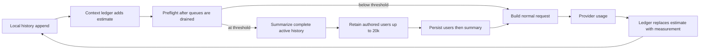

# Codex-level context efficiency without provider lock-in

Status: All six phases are complete; verification evidence and independent audit results are recorded below.

This file is the handoff contract for a fresh implementation session. Execute one phase at a time, keep Xal buildable and runnable after every phase, run each phase's verification before proceeding, and update `Progress` only after the phase is green. File and line citations describe the planning-time tree on 2026-08-26; if the tree drifts, relocate the cited symbol before editing instead of trusting a stale line number.

## Outcome

Increase primary and subagent context longevity by replacing Xal's large operational compaction tail with a small provider-neutral checkpoint, while improving accounting, observability, cache reuse, and failure safety.

The release gates are:

1. New compactions retain no assistant messages, reasoning, tool calls, tool results, direct-shell output, or provider replay.
2. Median provider-reported input on the first completed normal request after production-scale automatic compaction is at most 35,000 tokens. The measured planning baseline is 62,597. A 32,000-token estimated replacement-request budget provides headroom before live verification.
3. Representative numeric replays produce at least 20% fewer completed automatic compactions in aggregate than the frozen legacy policy, with no workload increasing.
4. Total provider input with zero cache credit, paired provider latency, and continuation-quality pass rate do not regress. Provider-reported cache reads and derived uncached input remain required diagnostics, but are not release gates because identical requests did not reproduce the same cache attribution.
5. The existing checks remain enabled, the CLI remains runnable, legacy sessions resume unchanged, and plugins acquire no dependencies on one another.

## Context and evidence

Xal currently checks automatic compaction before each model round (`apps/cli/src/agent/session/turn.ts:60-81`). It treats provider input plus output as active context (`apps/cli/src/providers/types.ts:75-84`, `apps/cli/src/agent/session/session.ts:1500-1504`), falls back to an 85% context-window trigger (`apps/cli/src/agent/session/compaction.ts:248-270`), and retains an arbitrary 25% suffix of complete conversation rounds (`apps/cli/src/agent/session/compaction.ts:21-24`, `apps/cli/src/agent/session/compaction.ts:109-145`). On an ordinary 260,000-token OpenAI window, this creates a 65,000-token tail. The active checkpoint is materialized as summary first, followed by that unsummarized suffix (`apps/cli/src/agent/history.ts:69-83`).

The profiler corpus under `~/.xal/profiler` was parsed across 219 files and joined to matching persisted sessions where possible. The stable planning baseline is:

| Metric | Baseline |
| --- | ---: |
| Active primary sessions with provider requests | 222 |
| Primary sessions with compaction | 40 |
| Completed primary compaction requests | 64 |
| Median `tokensBefore` | 222,572 |
| Median first normal input after compaction | 62,597 tokens |
| Median compaction request input | 177,120 tokens |
| Median compaction output | 4,508 tokens |
| Median compaction latency | 59.6 seconds |
| Compaction cache-read share | 0.97% |
| Normal-request cache-read share | 97.38% |
| Median retained tool-result text in matched transcripts | 119,574 characters |
| Median serialized retained array in matched transcripts | 292,518 characters |
| Median persisted summary | 18,253 characters |

Tool-result strings alone account for 43.4% of serialized retained-tail characters in the matched sample; encrypted reasoning and tool replay account for much of the rest. Xal already bounds normal model-visible tool output to 2,000 lines or 50 KiB and saves the full output separately (`apps/cli/src/tools/output.ts:4-6`, `apps/cli/src/tools/output.ts:98-117`), but those bounded outputs are still inserted into history verbatim (`apps/cli/src/agent/session/session.ts:1481-1483`). This makes arbitrary tail retention, not the initial prompt, the evidenced root cause. Normal prompt caching is already strong.

Codex's provider-neutral local compaction instead summarizes the session, retains only newest genuine user messages within an approximate 20,000-token budget, and puts the generated summary last (`discovery/source-codes/codex/codex-rs/core/src/compact.rs:520-547`, `discovery/source-codes/codex/codex-rs/core/src/compact.rs:616-690`). Its default auto-compaction threshold is 90% of the resolved window, with configured limits clamped to that ceiling (`discovery/source-codes/codex/codex-rs/protocol/src/openai_models.rs:420-431`, `discovery/source-codes/codex/codex-rs/protocol/src/openai_models.rs:468-479`). These two properties are the relevant comparison; Codex's remote compaction, code mode, deferred tools, and incremental WebSocket transport are not prerequisites for the locked outcome.

## Locked decisions

1. Context longevity is the primary objective: fewer compactions and a smaller post-compaction working set. Total provider input before cache credit, latency, and continuation quality are non-regression gates. Cache-adjusted input remains visible diagnostic evidence.
2. Scope covers the entire model-visible context pipeline for primary and subagent sessions: prompt/tool shape, history and tool output, active-token accounting, compaction, cache identity, persistence/resume, and profiler evidence.
3. Unrelated TUI rendering, shell-process execution speed, model selection, and provider network performance are excluded.
4. The baseline must be provider-neutral. Optional provider behavior is allowed only behind provider-declared capabilities with a concrete consumer; plugins must remain independent.
5. Work proceeds in measured increments: privacy-safe instrumentation first, then accounting, retention, and cadence. Every phase leaves the build green and the app runnable.
6. The exact quantitative gates are the five listed in `Outcome`.

## Architecture contract



### 1. Active-context ledger

Create `apps/cli/src/agent/session/context-budget.ts` as the single provider-neutral owner of context estimates and admission limits. It must not be global mutable state.

The ledger has two sources plus an exact preflight snapshot:

- The last provider-measured active context, defined exactly as `totalInputTokens + outputTokens`.
- Estimated tokens appended locally after that response.
- A full estimate of the exact candidate `StreamRequest`: instructions, serialized tool schemas, every input item, images/replay, and request-only input.

Required transitions:

- `observe(usage, identity)` replaces the measured value, records `{provider, profileId, request model, conversation model, cacheKey}`, and clears appended estimates. Provider output represented in the same response must not be counted again.
- A locally authored user item, internal user notice, tool result, direct-shell projection, queued background result, or no-usage interrupted provider item adds an estimate.
- A completed provider response commits its output items and usage atomically. If the response has usage, observe it after committing the items; if it has no usage, estimate the committed items.
- Compaction, rewind, redo, and resume invalidate provider measurement. History estimation remains useful for local deltas, but admission always estimates the complete candidate request rather than history alone. Keep recorded context available for historical UI/events if needed; do not seed admission from a measurement whose request identity was not persisted.
- When the candidate identity matches the measured identity, admission uses the greater of `measured + appended` and the complete request estimate. When it differs, admission discards the incompatible measurement and uses the complete request estimate. This covers model/profile changes, mode/cwd/plan/tool changes that alter `cacheKey`, and provider tokenizer changes. `setModel` currently leaves old context usage in place (`apps/cli/src/agent/session/session.ts:657-675`), so identity mismatch—not coincidental numeric similarity—must decide reuse.

The current stream applies usage before turn code later pushes provider items (`apps/cli/src/agent/session/stream.ts:241-250`, `apps/cli/src/agent/session/turn.ts:79-87`). Refactor this seam explicitly so a common `pushItem` path cannot double count measured output.

Add a pure shared `estimateRequestTokens({instructions, tools, input})` in `apps/cli/src/providers/request-size.ts`. The Phase 1 profiler shape calculator and Phase 2 ledger both consume it; do not duplicate estimation under the profiler. Use the existing character/image/replay estimator for request components and unmeasured deltas. Keep matching provider-reported usage authoritative; do not add tokenizer dependencies.

### 2. Preflight and failure safety

Move automatic compaction in `runTurn` to after background results, agent questions, and queued user input have been drained. Today queued input is appended after the preflight (`apps/cli/src/agent/session/turn.ts:60-81`), so a large newly drained prompt or tool result can bypass admission.

Immediately before sampling, build the exact normal `StreamRequest`, including `transientQuestionInput` (`apps/cli/src/agent/session/session.ts:1531-1547`), and ask the ledger to admit that snapshot. If compaction runs, discard the snapshot, rebuild from replacement history, and admit again. Pass the admitted request object to the provider instead of rebuilding it later; the request that was measured is the request that must be sent and profiled.

Admission rules:

- Before Phase 4, preserve the 85% automatic threshold so accounting changes are independently attributable.
- In Phase 4, use `min(model.autoCompactTokenLimit ?? infinity, floor(contextWindow * 0.90))`.
- Treat the catalog `contextWindow` as Xal's usable hard window. Do not apply another usable-window percentage. OpenAI's ordinary window is already capped to 260,000 (`apps/cli/src/plugins/openai/context-window.ts:1-10`, `docs/providers.md:98-107`).
- Never send a normal request when the ledger is at or beyond the hard window.
- Summary replacement is atomic: no history mutation until a non-empty summary completes.
- Retry automatic compaction once only for a retryable `ProviderError` when the attempt received no provider event. Do not retry interruptions, empty summaries, non-retryable failures, or any failure after an event.
- If required automatic compaction still fails, throw a context-compaction error and fail that turn with history unchanged. Do not issue the normal provider request.

Delete `MAX_COMPACTION_FAILURES`, the session failure counter, and the two-failure suppression once fail-closed admission exists (`apps/cli/src/agent/session/compaction.ts:194-205`, `apps/cli/src/agent/session/compaction.ts:248-271`). They would have no valid consumer.

Make retry eligibility observable rather than inferred. `collectStreamedText` currently keeps `received` private and always defaults profiler attempt to 1 (`apps/cli/src/providers/streamed-text.ts:27-63`). Add a typed streamed-text attempt failure carrying the original cause, `receivedEvent`, and attempt number. Thread attempt 1/2 from `runCompaction` through `summarizeHistory` to `collectStreamedText`; preserve the original error as the cause and record distinct anonymous request labels with accurate attempt values.

### 3. Typed compaction checkpoint

Make `CompactionItem` an additive union in `apps/cli/src/agent/history.ts`:

```ts
type CompactionItem =
  | {
      type: "compaction"
      summary: string
      replaced: number
      tokensBefore?: number
      retained: ConversationItem[]
    }
  | {
      type: "compaction"
      strategy: "user_messages_v1"
      summary: string
      replaced: number
      tokensBefore?: number
      retained: UserMessageItem[]
    }
```

The missing `strategy` is the legacy format. Its active-history order and existing `summaryMessage` preamble remain `[summaryMessage(summary), ...retained]` byte-for-byte. New records use `[...retained, continuationSummaryMessage(summary)]`. Keep session metadata at version 2; this is an additive record variant, not a session-file migration. The current parser and latest-compaction floor are at `apps/cli/src/sessions/records.ts:492-503` and `apps/cli/src/sessions/store.ts:218-251`.

Do not reuse the legacy preamble for summary-last history: it says the summary covers events before “messages that follow” (`apps/cli/src/agent/history.ts:42-49`), but no retained message follows it in the new ordering. Add a strategy-specific handoff message that says the retained requests and authoritative state summary describe work to continue, with the summary payload last. It must not claim later messages exist and must carry no `messageId`, so repeated compaction never mistakes it for authored input. This mirrors the explicit handoff role of Codex's summary prefix (`discovery/source-codes/codex/codex-rs/prompts/templates/compact/summary_prefix.md:1`).

New checkpoint rules:

- Summarize the complete `activeHistory`, including the previous summary and every late operational item.
- Select only genuine user-authored messages carrying `messageId`. Internal notices and synthesized summaries do not carry one.
- Walk newest to oldest within a 20,000 estimated-token budget, truncate only the oldest boundary message when needed, then restore chronological order.
- Preserve `text`, provider-visible `modelText`, and `messageId`; store no images. Extend the existing image-omission behavior (`apps/cli/src/providers/conversation.ts:36-49`) so both `text` and `modelText`, when present, tell the model how many attachments were omitted.
- Extract the existing UTF-8-safe prefix/suffix logic from `apps/cli/src/tools/output.ts:44-95` into a shared text primitive, preserve tool-output behavior byte-for-byte, and use the same primitive for explicit middle truncation of the oldest retained user message.
- Never directly retain an assistant message, reasoning item, tool call, tool result, direct shell item, provider replay, or synthetic summary.
- A second compaction includes the prior summary in the material summarized, excludes it from authored-user retention, and writes a fresh `user_messages_v1` record. A legacy checkpoint may be converted on the next compaction; loading alone never rewrites it.
- Define `replaced` as the number of model-visible active conversation items not directly retained in the new checkpoint. Record `tokensBefore` from the ledger before replacement.
- Treat a `user_messages_v1` checkpoint with no later items as already compacted and return `nothing`; a legacy checkpoint remains eligible for conversion.

The 20k authored-user allowance is a ceiling, not a promise. After summary generation, build the complete next normal-request shape with the strategy-specific summary and no retained users. Allocate retained-user tokens as `min(20_000, max(0, 32_000 - baseRequestEstimate))`, then build and estimate the final replacement request. Commit only if that complete estimate is at most 32,000. Never truncate the generated summary silently; if instructions/tools plus the summary already exceed the target, fail compaction atomically with history unchanged. This fixed provider-neutral invariant prevents a longer full-history summary from consuming the entire post-compaction window and leaves 3k tokens of estimator headroom for the `<=35,000` provider-observed gate.

The parser must fail loudly on unknown strategies and reject `user_messages_v1` records containing a non-user item, a user item without `messageId`, or a retained image. Redaction must preserve the discriminant and redact both variants exhaustively (`apps/cli/src/secrets/data.ts:84-100`).

### 4. Summary request and cache identity

Keep the current compaction target policy: the same underlying model, its optional `-fast` service variant, and low thinking (`apps/cli/src/agent/session/compaction.ts:57-69`). Model selection is explicitly out of scope.

For the request itself:

- Use a provider-neutral semantic projection of complete active history plus the existing summary instruction as the final user message. Preserve user and assistant text, reasoning summaries, tool calls, and tool results while removing opaque provider replay payloads.
- Keep the normal system instructions with `toolChoice: "none"`. Omit tool definitions because the summary request cannot call them, and recompute `cacheKey` from the exact schema-free prompt.
- Build `instructions`, `tools`, and `cacheKey` through `host.prompt(originalConversationModel)`, while sending the request to the resolved compaction target and setting `conversationModel` to the original model.
- Update `redactStreamRequest` to validate/recompute cache identity from the redacted `conversationModel ?? model`, not unconditionally from the transmitted fast target. It currently overwrites `cacheKey` from `request.model` (`apps/cli/src/secrets/data.ts:111-123`).

Normal requests rebuild complete active history with the normal prompt prefix (`apps/cli/src/agent/session/session.ts:1509-1547`). OpenAI transports send the stable prompt cache key (`apps/cli/src/plugins/openai/chatgpt-transport.ts:20-44`, `apps/cli/src/plugins/openai/api-transport.ts:23-48`). Live profiling on 2026-08-27 showed no cache reads across either base/fast service tiers or high/low reasoning tiers for the summary request. Omitting unusable tool schemas reduced the Phase 3 observed uncached input while preserving the complete semantic transcript.

### 5. Threshold metadata

The effective threshold helper belongs in `context-budget.ts` and applies to every provider. Existing `ModelInfo.autoCompactTokenLimit` remains the optional provider-declared input (`apps/cli/src/providers/types.ts:56-63`); do not add a new capability type for the same fact.

Teach ChatGPT runtime discovery and its secure cache to round-trip optional `auto_compact_token_limit`. The runtime parser currently reads context and maximum context but ignores that field (`apps/cli/src/plugins/openai/chatgpt-models.ts:128-145`, `apps/cli/src/plugins/openai/chatgpt-models.ts:175-204`). Clamp a runtime limit through the shared effective-threshold helper after applying Xal's context cap. Missing metadata uses the 90% fallback. Unknown or malformed values are omitted at this optional upstream seam; the core catalog continues to reject invalid internal model records (`apps/cli/src/providers/catalog.ts:110-139`).

### 6. Privacy-safe evidence

Extend the profiler with numeric/count-only records:

- `provider_request_shape`, joined by anonymous request label: estimated input tokens and item counts split by user, assistant, reasoning, tool call, and tool result; instruction bytes; tool count; total schema bytes; total estimated request tokens.
- `tool_output_shape`, joined only to anonymous session/kind/tool labels: original bytes, model-visible bytes, estimated visible tokens, and whether bounding occurred.
- `compaction_shape`: trigger, strategy, outcome, tokens before and estimated after, retained authored-user count/tokens, summary estimated tokens, and removed counts by item type.

Continue recording provider usage, cache tokens, phase, latency, and anonymized labels. Never record prompt text, response text, summaries, paths, working directories, JSON arguments, output, schema content, call IDs, real session IDs, provider profile IDs, or credentials. Add a test that serializes every new record shape and recursively rejects any string field outside an explicit structural/anonymized allowlist. The current anonymous event projection is at `apps/cli/src/profiler/profiler.ts:263-399`; request lifecycle records are at `apps/cli/src/profiler/profiler.ts:462-515`.

Create a deterministic, versioned numeric replay fixture. Its generator may read explicitly supplied local profiler/session directories, but it must not emit source paths, timestamps precise enough to identify a session, text, IDs, or hashed text. CI and future development consume only the committed sanitized fixture.

Validate and round-trip this content-free workload schema before simulation:

- workload version and session `kind`;
- ordered event index and round boundary;
- item kind, estimated model-visible tokens, replay estimate, `authoredUser` boolean, `hasModelText` boolean, image count, and image-token estimate;
- request static-prefix estimate, provider-usage boundary, reported usage/cache/latency, and whether the observation followed compaction;
- context window and automatic/manual compaction trigger, outcome, summary estimate, and replacement boundary.

These fields are sufficient to distinguish authored users from synthetic user-role notices and to run both policies without reopening a private transcript. Add strict parser validation and a read/write round-trip test for the committed fixture.

The replay implements both the frozen legacy policy and candidate policy over the identical workloads:

1. Primary tool-heavy.
2. Primary repeated-compaction.
3. Subagent tool-heavy.

Calibrate the frozen legacy replay against the planning baseline before changing runtime behavior. The fixture becomes the comparison source even though `~/.xal/profiler` continues to change.

## Explicitly deferred work

- Lowering tool-output caps. Current data proves retained outputs are expensive but does not provide an original/output-size distribution that justifies a new cap. Instrument first; revisit in a later plan if the new profiler proves an additional bottleneck.
- Deferred built-in tools, code mode, or broad schema pruning. The initial request in a representative long session was about 5.5k tokens and normal cache-read share was 97.38%; current evidence does not attribute the compaction problem to schemas.
- `previous_response_id`, stored Responses, or WebSocket deltas. Both OpenAI transports currently use `store:false`, and Xal has no response-ID seam. This needs a separate privacy/resume design.
- Provider remote compaction. OpenAI's opaque compaction item is not a provider-neutral checkpoint and Xal deliberately drops incompatible replay when provider/model changes (`apps/cli/src/providers/conversation.ts:15-33`). Do not add an unused capability. Revisit only with a concrete consumer and a portable recovery path.
- Provider tokenizers. Provider measurement is authoritative and the estimator is deliberately limited to unmeasured deltas.
- Changing the compaction target model or thinking policy.

## Implementation phases

### Phase 1: Instrument and freeze the baseline

Goal: make context costs attributable without changing request, trigger, retention, retry, or persistence behavior.

Paths:

- `apps/cli/src/profiler/profiler.ts`
- `apps/cli/src/profiler/shapes.ts` (new)
- `apps/cli/src/profiler/profiler.test.ts` (new)
- `apps/cli/src/providers/request-size.ts` (new shared estimator)
- `apps/cli/src/providers/request-size.test.ts` (new)
- `apps/cli/src/agent/session/stream.ts`
- `apps/cli/src/providers/streamed-text.ts`
- `apps/cli/src/agent/session/tool-runner.ts`
- `apps/cli/src/agent/session/compaction.ts`
- `apps/cli/src/agent/session/session.ts`
- `scripts/context-efficiency.ts` (new)
- `scripts/fixtures/context-efficiency-v1.json` (new, sanitized numeric data only)
- `scripts/fixtures/context-efficiency-live-v1.json` (new, wholly synthetic live scenarios)
- `scripts/fixtures/context-efficiency-live-baseline-v1.json` (new, sanitized numeric results)
- `package.json`
- `docs/integrations.md`
- `.agents/skills/health-check/SKILL.md`

Work:

1. Add the shared request estimator, pure profiler request/tool/compaction shape calculators, and the three profiler record types. Capture request shape immediately after request construction in both normal and streamed-text paths. Capture original versus bounded tool-output sizes around the existing `boundToolOutput` call. Pass compaction metrics through the existing session host boundary without coupling profiler code into compaction policy.
2. Add privacy tests for every emitted record and verify profiler failures still fail loudly rather than affecting model requests.
3. Add the explicit-input fixture generator and a simulator for the exact current 85%/25%-tail policy. Commit three sanitized workloads and a versioned baseline report in the fixture.
4. Add `benchmark:context` without weakening `checks`. Its command contract is:
   - `bun benchmark:context -- --fixture scripts/fixtures/context-efficiency-v1.json --policy legacy`
   - `bun benchmark:context -- --fixture scripts/fixtures/context-efficiency-v1.json --policy candidate --threshold 0.85 --gate retention`
   - `bun benchmark:context -- --fixture scripts/fixtures/context-efficiency-v1.json --policy candidate --threshold 0.90 --gate release`
   - `bun benchmark:context -- --live capture --scenarios scripts/fixtures/context-efficiency-live-v1.json --suite SUITE --label LABEL --runs 3 --connection CONNECTION_NAME --model MODEL_ID --output RESULT_JSON`
5. Add fixed secret-free live scenarios executed through the public `AgentSession` path in a generated temporary workspace:
   - primary and subagent tool-heavy runs with the same forced manual-compaction boundary for paired cache/latency/continuation comparison;
   - primary and subagent automatic-admission runs with a 64,000-token benchmark-only context window, implemented by wrapping model-catalog metadata while delegating to the real provider stream. The scenario validator must prove the window exceeds its maximum estimated post-compaction request. This cheaply exercises the automatic pipeline without changing persistent production configuration.
   - a release-only production-scale automatic scenario for both session kinds. It appends varied, wholly synthetic operational-state notices through public session APIs until the complete request estimator reaches the selected model's real effective automatic threshold, then lets the real provider summarize and measures the next request. Do not lower catalog context for this suite. Run it once per kind because it intentionally sends a production-scale summary request.
   - marker-based continuation responses scored without storing generated text.
     The sanitized result records numeric usage/cache/latency/pass data, anonymous labels, session kind, and the effective benchmark window, never generated/source text or the connection name.
6. Correct the stale Tack names, paths, timestamp fields, labels, and record descriptions in the health-check skill. Document profiler privacy and numeric shape records in `docs/integrations.md`.
7. Before any behavior-changing phase, obtain authorization for the billable live run and capture the three-run legacy result with the exact connection/model/thinking configuration that later candidate runs will reuse. If authorization or provider access is unavailable, Phase 1 code may be green, but stop before Phase 2 rather than losing the paired baseline.

Critical tests:

- Profiler records contain only the enumerated safe strings and numeric/count data.
- Retried requests produce distinct request-shape records joined to their own anonymous request labels.
- Tool bounding reports original and visible sizes without writing content.
- Legacy simulator reproduces the fixture's recorded compaction count and post-compaction median within a declared 1% rounding tolerance.
- Strict fixture parsing rejects missing authored/model-text/image/round/prefix/usage/compaction fields, and a fixture read/write round trip preserves the exact numeric shape.
- Primary and subagent records remain distinguishable by `kind`.

Phase verification:

```sh
bun test apps/cli/src/profiler/profiler.test.ts apps/cli/src/providers/request-size.test.ts apps/cli/src/agent/session/compaction.test.ts apps/cli/src/tools/output.test.ts
bun benchmark:context -- --fixture scripts/fixtures/context-efficiency-v1.json --policy legacy
bun checks:fix
bun apps/cli/src/index.ts --help
```

Authorized live baseline command, substituting the chosen connection/model:

```sh
bun benchmark:context -- --live capture --scenarios scripts/fixtures/context-efficiency-live-v1.json --suite paired --label legacy --runs 3 --connection CONNECTION_NAME --model MODEL_ID --output scripts/fixtures/context-efficiency-live-baseline-v1.json
```

Exit: the frozen numeric and authorized live baselines are reproducible, no raw content entered git, existing compaction tests still assert legacy behavior, all checks pass, and `--help` exits successfully.

### Phase 2: Make accounting and admission correct

Goal: prevent locally appended context from bypassing compaction and prevent a failed required compaction from sending an over-limit request. Retention and the 85% trigger remain unchanged in this phase.

Paths:

- `apps/cli/src/agent/session/context-budget.ts` (new)
- `apps/cli/src/agent/session/context-budget.test.ts` (new)
- `apps/cli/src/agent/session/stream.ts`
- `apps/cli/src/agent/session/turn.ts`
- `apps/cli/src/agent/session/session.ts`
- `apps/cli/src/agent/session/compaction.ts`
- `apps/cli/src/providers/streamed-text.ts`
- `apps/cli/src/providers/streamed-text.test.ts` (new)
- `apps/cli/src/agent/session/compaction.test.ts`
- `apps/cli/src/agent/session/session.test.ts`
- `apps/cli/src/agent/session/session-control.test.ts`
- `docs/commands-and-skills.md`

Work:

1. Implement the ledger, request identity, and complete request estimator from `Architecture contract`. Split local-item and measured-provider commit paths and invalidate incompatible measurement on resume, compaction, rewind, redo, model/profile changes, or prompt/cache identity changes.
2. Return/commit provider items and usage atomically. Cover successful usage, missing usage, and mid-stream interruption without losing saved assistant output or double counting it.
3. Move preflight after all drains, build the complete candidate request including transient question input, admit it, rebuild/re-admit after compaction, and send that admitted snapshot unchanged. Keep `COMPACTION_TRIGGER_RATIO = 0.85` for attribution.
4. Add typed streamed-text attempt failures and accurate attempt telemetry. Retry one eligible automatic compaction attempt, fail the turn with unchanged history when it still fails, enforce the hard window, and delete failure suppression/counter state.
5. Document `/compact`, automatic preflight, atomic replacement, and failure behavior.

Critical tests:

- Provider input/output is counted once when usage exists; no-usage committed output is estimated once.
- A 50 KiB tool result, a queued large prompt, background delivery, agent-question delivery, and an output-contract correction all affect the next preflight.
- Instructions, serialized tool schemas, transient question input, and every input item contribute to the full candidate estimate.
- A changed model/profile or changed cache key from mode, cwd, plan, or available tools cannot reuse an incompatible provider measurement.
- The provider receives the same request snapshot that passed admission; a post-compaction snapshot is rebuilt and rechecked.
- A retryable pre-event compaction failure retries once with profiler attempts 1/2 and distinct request labels; any received event, interruption, empty completion, or non-retryable failure prevents retry.
- No normal provider stream starts after required compaction fails or at the hard window.
- Successful compaction resets the ledger from the replacement estimate.
- Resume, undo, and redo invalidate request measurement and admit from the next complete request estimate.
- The same cases run for `kind: "primary"` and `kind: "subagent"` through their shared session path.

Phase verification:

```sh
bun test apps/cli/src/agent/session/context-budget.test.ts apps/cli/src/agent/session/compaction.test.ts apps/cli/src/agent/session/session.test.ts apps/cli/src/agent/session/session-control.test.ts apps/cli/src/providers/streamed-text.test.ts
bun benchmark:context -- --fixture scripts/fixtures/context-efficiency-v1.json --policy legacy
bun checks:fix
bun apps/cli/src/index.ts --help
```

Exit: accounting/admission tests pass, the legacy replay remains unchanged, checks are green, and the CLI smoke path runs.

### Phase 3: Replace the operational tail

Goal: write provider-neutral `user_messages_v1` checkpoints, summarize every dropped operational fact, preserve legacy semantics, and improve compaction cache identity. Keep the 85% trigger until this phase independently passes quality and cost gates.

Paths:

- `apps/cli/src/lib/text.ts` (new shared UTF-8-safe truncation primitive)
- `apps/cli/src/tools/output.ts`
- `apps/cli/src/tools/output.test.ts`
- `apps/cli/src/agent/history.ts`
- `apps/cli/src/agent/session/compaction.ts`
- `apps/cli/src/agent/session/compaction.test.ts`
- `apps/cli/src/agent/session/session-control.test.ts`
- `apps/cli/src/sessions/records.ts`
- `apps/cli/src/sessions/records.test.ts` (new)
- `apps/cli/src/sessions/store.test.ts`
- `apps/cli/src/secrets/data.ts`
- `apps/cli/src/secrets/data.test.ts`
- `apps/cli/src/providers/conversation.ts`
- `apps/cli/src/providers/conversation.test.ts`
- `scripts/context-efficiency.ts`
- `scripts/fixtures/context-efficiency-live-selective-v1.json` (new, sanitized numeric results)
- `docs/commands-and-skills.md`

Work:

1. Add the legacy/new compaction union and strategy-specific active-history ordering. Preserve the legacy branch exactly.
2. Implement authored-user selection, the dynamic 32k replacement-request budget with a 20k user ceiling, image omission, boundary middle truncation, full-history summary input, repeated-compaction behavior, and the new summary-last handoff message. Preserve the legacy preamble only for legacy records.
3. Parse, redact, persist, load, resume, rewind, and redo both formats. Unknown strategies and invalid new retained items fail loudly. Do not bump session metadata version and do not rewrite a session merely because it was loaded.
4. Build the summary prompt/cache identity from the original conversation model while retaining the existing fast/low target. Preserve instructions, omit unusable tool definitions, and recompute the schema-free cache identity. Make redaction recompute/validate from `conversationModel ?? model` so it cannot silently switch back to the fast-target identity.
5. Add the candidate simulator and continuation fixtures/probes. The deterministic probe must include exact user constraints, current task state, a recorded failure, and late tool facts so loss is observable.

Critical tests:

- Every new retained item is an image-free user message with `messageId`; operational-tail violations are exactly zero.
- The oldest boundary user message truncates explicitly and Unicode-safely; newer messages are whole and chronological.
- The final complete request estimate is at most 32k; a larger static-prefix-plus-summary result leaves history unchanged and fails loudly rather than truncating the summary.
- The summarizer receives all active operational items, including a late tool result, exactly once.
- Active history is retained users then the new handoff summary for new records, but the unchanged legacy summary preamble then retained tail for legacy records. The new final message does not refer to messages that follow, has no `messageId`, and is excluded from authored retention on repeated compaction.
- A byte-for-byte legacy record parses/loads without semantic rewrite; a new record writes and reads in the same shape.
- Resume both formats produces the expected next provider input; compacting a resumed legacy session writes the new strategy.
- Rewind and redo work across both compaction floors.
- The summary request has complete semantic history without opaque replay, `toolChoice: "none"`, unchanged instructions, no tool definitions, a cache key recomputed from that exact original-model prompt, the resolved compaction target, and no mutation on empty/failed output. `redactStreamRequest` preserves the original conversation-model cache identity for a fast-target request.
- Existing tool-output tests prove the shared truncation extraction did not alter tool output.

Phase verification:

```sh
bun test apps/cli/src/agent/session/compaction.test.ts apps/cli/src/agent/session/session-control.test.ts apps/cli/src/sessions/records.test.ts apps/cli/src/sessions/store.test.ts apps/cli/src/secrets/data.test.ts apps/cli/src/providers/conversation.test.ts apps/cli/src/tools/output.test.ts
bun benchmark:context -- --fixture scripts/fixtures/context-efficiency-v1.json --policy candidate --threshold 0.85 --gate retention
bun checks:fix
bun apps/cli/src/index.ts --help
```

Before advancing, capture the candidate with the same authorized connection, model, thinking effort, scenarios, and three-run count as Phase 1:

```sh
bun benchmark:context -- --live capture --scenarios scripts/fixtures/context-efficiency-live-v1.json --suite paired --label selective-85 --runs 3 --connection CONNECTION_NAME --model MODEL_ID --baseline scripts/fixtures/context-efficiency-live-baseline-v1.json --output scripts/fixtures/context-efficiency-live-selective-v1.json
```

Compare total provider input across normal plus compaction requests without subtracting cache reads, total provider wall time, p95 normal-turn latency, and continuation pass rate. Treat changes within 5% as measurement noise for latency only. Total provider input and continuation pass rate may not regress. Preserve provider-reported cache reads and derived uncached input as diagnostics. If the paired configuration cannot be reproduced, record the gate as unverified and stop rather than claiming the phase complete.

Exit: compatibility and zero-tail tests pass; deterministic metrics meet their gates; the paired live run shows no total-provider-input, latency beyond noise, or continuation regression; checks and smoke are green.

### Phase 4: Raise the cadence threshold to 90%

Goal: realize fewer compactions after the replacement is small and admission is correct.

Paths:

- `apps/cli/src/agent/session/context-budget.ts`
- `apps/cli/src/agent/session/context-budget.test.ts`
- `apps/cli/src/agent/session/compaction.ts`
- `apps/cli/src/plugins/openai/chatgpt-models.ts`
- `apps/cli/src/plugins/openai/chatgpt-models.test.ts`
- `apps/cli/src/plugins/openai/model-variants.test.ts`
- `apps/cli/src/providers/catalog.test.ts`
- `scripts/context-efficiency.ts`
- `docs/providers.md`

Work:

1. Change the default threshold to 90%, clamp explicit limits to that ceiling, and retain the 100% hard admission check.
2. Round-trip optional ChatGPT runtime/cache `auto_compact_token_limit` and ensure context capping cannot yield an invalid effective limit. Do not require the upstream field.
3. Update provider documentation for the default, explicit limit, hard window, and existing OpenAI context cap/large variants.
4. Make the release replay gate enforce the structural and cadence metrics that a deterministic replay can establish. Simulate candidate summary sizes at the observed legacy median, p90, maximum, and a conservative 10,000-token sensitivity bound. Apply the dynamic 32k replacement budget in every case and require the cadence gate at the conservative bound. Total provider input, live latency, provider-reported post-compaction input, and continuation quality remain live gates; do not invent candidate cache hits, latency, or exact summary output in the simulator.

Critical tests:

- Missing explicit limit produces exactly `floor(window * 0.90)`.
- A lower explicit limit wins; a higher explicit limit is clamped to 90%; invalid internal catalog records still fail.
- The hard window prevents normal sampling regardless of threshold metadata.
- Runtime, secure-cache, capped ordinary, fast, and large-context ChatGPT variants preserve a valid optional limit.
- The candidate replay has zero operational-tail violations and every simulated summary-size case keeps the estimated first normal request after automatic compaction at most 32,000.
- Automatic compactions are at least 20% lower in aggregate than legacy and do not increase in any individual workload.

Phase verification:

```sh
bun test apps/cli/src/agent/session/context-budget.test.ts apps/cli/src/agent/session/compaction.test.ts apps/cli/src/plugins/openai/chatgpt-models.test.ts apps/cli/src/plugins/openai/model-variants.test.ts apps/cli/src/providers/catalog.test.ts
bun benchmark:context -- --fixture scripts/fixtures/context-efficiency-v1.json --policy candidate --threshold 0.90 --gate release
bun checks:fix
bun apps/cli/src/index.ts --help
```

Exit: all replay and metadata gates pass, all checks are green, and the CLI remains runnable.

### Phase 5: Profiled release validation

Goal: prove the integrated behavior in fresh primary and subagent runs and leave documentation/evidence ready for release.

Work:

1. Run the scenario file's sanitized paired and 64k automatic-admission workloads for both primary and subagent kinds with profiler capture enabled. Inspect only the new numeric records through the updated health-check procedure.
2. Repeat the three-run paired live comparison from Phase 3 after the 90% change. Use the same provider/model/workloads and freeze the result next to the numeric fixture without prompts, identifiers, or raw timestamps.
3. Confirm the definitions below are computed exactly:
   - First post-compaction context: `totalInputTokens` from the next completed `phase: "turn"` request in the same anonymous session after a successful automatic compaction.
   - Compaction reduction: `(legacy automatic completed - candidate automatic completed) / legacy automatic completed`; manual compactions are excluded.
   - Total provider input: sum of `totalInputTokens` across normal and compaction requests, with no cache credit. Candidate may not exceed baseline per workload. This cache-independent upper bound is the release gate.
   - Cache diagnostic: also record `sum(max(0, totalInputTokens - cacheReadInputTokens))`. A change is reported but does not fail the release because repeated identical requests produced different provider cache attribution.
   - Latency: paired median total provider wall time per workload and p95 normal-request latency; at most 5% measurement noise.
   - Continuation quality: fixed marker-based probe pass rate over three identical runs; candidate may not score below baseline.
4. Re-read `docs/integrations.md`, `docs/providers.md`, `docs/commands-and-skills.md`, and `.agents/skills/health-check/SKILL.md` against the final record/request behavior. Correct drift in the same phase.
5. Run the full release checks once more. Do not weaken CI, skip a failing workload, or average away a per-workload regression.
6. With separate authorization for the intentionally large request, run the production-scale automatic suite once for primary and once for subagent. It must use the selected model's real catalog window, generate varied synthetic source history to the real auto threshold, record the actual summary size, and measure the next completed normal input. Both results must respect the 32k estimate before send; their median provider-reported input must be `<=35,000`. If this production-scale run is unavailable, the release gate remains unverified.

Phase verification:

```sh
bun benchmark:context -- --fixture scripts/fixtures/context-efficiency-v1.json --policy candidate --threshold 0.90 --gate release
bun checks:fix
bun apps/cli/src/index.ts --help
```

Authorized live release command, using the same substitutions as the Phase 1 baseline:

```sh
bun benchmark:context -- --live capture --scenarios scripts/fixtures/context-efficiency-live-v1.json --suite release --label release-90 --runs 3 --connection CONNECTION_NAME --model MODEL_ID --baseline scripts/fixtures/context-efficiency-live-baseline-v1.json --output scripts/fixtures/context-efficiency-live-release-v1.json
```

Authorized production-scale command; `--runs 1` applies once to each kind declared by the suite:

```sh
bun benchmark:context -- --live capture --scenarios scripts/fixtures/context-efficiency-live-v1.json --suite production --label release-production --runs 1 --connection CONNECTION_NAME --model MODEL_ID --output scripts/fixtures/context-efficiency-live-production-v1.json
```

Exit: both session kinds produce safe profiler data, all quantitative and quality gates pass, docs match behavior, checks are green, and the CLI smoke path succeeds.

### Phase 6: Post-implementation audit and hardening

This phase is mandatory after Phases 1-5 are implemented; it is not performed during planning.

1. Start a fresh audit agent with this plan, the full implementation diff, the frozen fixture/report, and the new profiled validation records.
2. Require factual findings with `file:line` evidence along these axes:
   - plan and locked-gate coverage;
   - active-token accounting and double-counting risks;
   - normal-request admission after every local append path;
   - legacy/new persistence, resume, rewind, redo, redaction, and invalid-record handling;
   - profiler privacy and fixture provenance;
   - cache-key/model/service-tier behavior;
   - primary/subagent parity;
   - plugin dependency direction and absence of unused abstractions;
   - docs, package commands, and health-check schema accuracy;
   - tests that could pass while the real runtime path remains wrong.
3. The implementation agent judges every finding against source and evidence. Reject false positives explicitly. Convert each accepted concern into one numbered hardening task with one concern, exact paths, exact tests, and an expected observable result.
4. Apply one task at a time. After each, run its targeted tests, `bun checks:fix`, the candidate 90% release replay gate, and the CLI smoke path. Keep the tree green between tasks.
5. Save the audit verdict and accepted/rejected findings in `.plans/audits/codex-context-efficiency.md`. Do not mark the plan complete while a Medium-or-higher accepted issue or any locked gate remains open.

## Definition of done

Functional:

- Both primary and subagent sessions account for local deltas and the full exact request shape, invalidate mismatched provider measurements, admit the same snapshot they send, and fail closed when required compaction cannot complete.
- New checkpoints retain only latest authored, image-free user messages within the smaller of the 20k ceiling and the remaining 32k complete-request budget, followed by the strategy-specific continuation handoff summary.
- Complete operational history is visible to the summarizer but absent from the post-compaction request.
- Legacy version-2 sessions preserve their old ordering and behavior until a later compaction writes the additive new strategy.
- Summary generation is atomic, bounded in event-aware retries, and preserves the original conversation-model cache identity through redaction while using the existing target-selection policy.

Measured:

- Operational-tail violations: `0`.
- Replacement request estimate: `<=32,000` across every replay sensitivity case and runtime compaction.
- Median first completed normal input after production-scale automatic compaction: provider-observed `<=35,000`.
- Automatic compaction reduction in aggregate: `>=20%`, with no individual workload increasing.
- Aggregate and per-workload total provider input before cache credit: no increase.
- Provider-reported cache reads and derived uncached input remain present in sanitized evidence and are reported as diagnostics.
- Paired latency: no regression beyond the predeclared 5% noise band.
- Continuation probe pass rate: no decrease.

Engineering guardrails:

- `bun checks:fix` and the CLI smoke command pass after every phase and audit fix.
- No lint suppressions, weakened tests/checks, global mutable ledger, unsafe `as` casts at wire boundaries, swallowed errors, source-code comments, speculative provider capability, or plugin-to-plugin dependency is introduced.
- Every new helper has a current consumer; shared behavior lives once; old failure-counter and tail-only code is deleted when unused.
- Session and profiler data written by Xal is read back in the same discriminated shape.
- Configuration/provider/profiler docs and the health-check skill match the shipped behavior.

## Known unverified facts

- OpenAI cache entries were not reused by the Phase 3 summary request across base and priority/`-fast` service tiers or across high/low reasoning tiers in the authorized paired workload. The shipped schema-free summary prompt does not depend on cross-tier cache reuse.
- Whether every ChatGPT runtime model includes `auto_compact_token_limit`. Parsing is optional and 90% remains the portable fallback.
- Production-scale full-history summaries fit the 32k replacement target and yielded provider-reported post-compaction input of 4,273 primary and 3,828 subagent tokens, with 6,001/5,307 runtime estimates. Both probe-v5 fact-recovery checks passed on 2026-08-27.
- Continuation quality passed all 12 three-run release scenarios and both probe-v5 production runs. Two probe-v4 production attempts failed subagent fact recovery even though every provider request completed: the first missed four continuation fields and three summary fields; the second missed two continuation fields and one summary field. The tracked passing evidence was recaptured only after the single authoritative state notice received explicit boundaries and an exact-value preservation instruction. The failed profiles remain documented rather than being treated as passing evidence.
- Repeated probe-v2 captures with unchanged request content alternated provider cache-read misses and first-event latency outliers. A fixed replication passed cache-adjusted input but failed subagent p95 after one ordinary request waited 7,594 ms for its first event. A later ordinary capture passed every latency gate but observed a primary cache-adjusted-input increase because two identical early requests received no cache credit. A discarded warm-up experiment did not stabilize cache attribution and is not used as release evidence. The exact profiles contain zero request, turn, tool, job, or harness failure markers.
- A valid time-matched diagnostic reconstructed the Phase 2 legacy runtime with the exact probe-v2 harness, configuration, fingerprints, and three-run count. It measured primary/subagent median provider time at 21,962/22,255 ms and p95 normal latency at 5,458/5,379 ms. This supports treating the alternating cache attribution and first-event delays as provider observations rather than a persistent candidate runtime path, but it does not replace the frozen Phase 1 baseline.
- The local profiler corpus is mutable. Only the Phase 1 sanitized fixture is a stable implementation baseline.
- No provider-neutral recovery for opaque remote compaction is verified.

## Progress

- [x] Phase 1 — Instrument and freeze the baseline. The deterministic legacy replay reproduces five automatic compactions with a 62,597-token median. The authorized three-run paired baseline for `Saeed` / `gpt-5.6-sol` passed for primary and subagent workloads with continuation rate 1, anonymous configuration/workload fingerprints, and no raw content. Targeted tests, `bun checks:fix`, CLI smoke, privacy validation, and independent review passed on 2026-08-27.
- [x] Phase 2 — Make accounting and admission correct. The session-owned ledger admits the exact request after all local drains, invalidates incompatible measurements, commits provider output and usage without double counting, retries only eligible pre-event compaction failures, and fails closed at required compaction or the hard window for primary and subagent sessions. The exact targeted suite passed 53 tests, the frozen legacy replay remained at five automatic compactions and a 62,597-token median, `bun checks:fix`, CLI smoke, and independent review passed on 2026-08-27.
- [x] Phase 3 — Replace the operational tail. New `user_messages_v1` checkpoints retain only image-free authored users before an authoritative summary, remain compatible with legacy records and repeated compaction, and enforce the 20k authored-user ceiling plus 32k complete-request budget. The corrected fact-recovery probe passed 6/6 live continuations. Against the recaptured probe-v2 baseline, primary/subagent total provider input improved from 389,829/381,593 to 383,598/376,798; observed cache-adjusted input also improved from 245,445/248,985 to 241,774/240,094. Primary latency improved within the gate, subagent latency stayed within 5% noise, and first post-compaction input fell from roughly 21.4–21.9k to 4.1–4.6k. The deterministic gate reported five compactions, a 12,500-token median, and zero operational tails; 75 targeted tests, 541 CLI tests, 17 website tests, checks/build/release, profiler health, and CLI smoke passed on 2026-08-27.
- [x] Phase 4 — Raise the cadence threshold to 90%. The shared effective-limit helper applies the 90% ceiling, honors lower provider limits, and leaves the hard window unchanged. ChatGPT runtime discovery and secure cache round-trip optional limits after the ordinary context cap, and ordinary, fast, and large-context variants preserve valid values. The release replay produced two automatic compactions versus the frozen legacy five, with no workload increase or operational tail; median, p90, maximum, and 10,000-token summary sensitivity cases all stayed within the 32k replacement budget. The exact 38-test suite, 546 CLI tests, 17 website tests, checks/build/release, and CLI smoke passed on 2026-08-27.
- [x] Phase 5 — The probe-v5 production-scale gate passed for primary/subagent continuation 2/2, provider input 4,273/3,828, and runtime estimates 6,001/5,307. The v5 automatic release recapture passed 6/6 continuations with first post-compaction provider input ranges of 4,224–4,337 primary and 3,855–3,880 subagent. Its complete-request construction now includes the calibrated static prompt prefix before targeting the exact automatic threshold. Two preceding probe-v4 production attempts honestly failed subagent fact recovery; the single final authoritative notice was therefore hardened and versioned before the passing evidence was captured. The ordinary non-warmed paired rows remain unchanged: cache-independent total provider input improved from 389,829/381,593 to 383,703/376,976, continuation passed 6/6, median latency was 16,647/19,866 ms, and p95 normal latency was 3,993/4,628 ms. Provider cache attribution remains diagnostic and its primary miss is preserved. The deterministic release gate, 29 focused tests with 141 assertions, CLI smoke, fixture validation, and profiler health checks passed on 2026-08-27; final full checks are repeated after review hardening.
- [x] Phase 6 — The fresh post-implementation audit inspected 49 files and 193 hunks on independent Standards and updated-plan Spec axes. Its hardening rejects missing, duplicate, wrong-kind, or unexpected paired workloads and fails any live request that omits provider input usage instead of counting it as zero. CodeRabbit follow-up fixes reserve the hard-window boundary in workload-specific simulated replacement caps, include static prompt tokens in automatic threshold setup, always unsubscribe the benchmark listener, reuse the shared image-token constant, initialize truncation from a safe marker, and use valid image test data. Workload fingerprints lock all paired, automatic, and production scenarios. The final review also enforces the exact fixture name-to-kind mapping, retains the complete legacy tail when it fits, and derives sensitivity bounds only from completed automatic compactions; 32 focused tests with 146 assertions cover the accepted fixes. The independent follow-ups caught and verified the hard-window equality issue and reviewed the final CodeRabbit delta with zero remaining Medium-or-higher issue. The complete failed/passing live provenance and PASS verdict are recorded in `.plans/audits/codex-context-efficiency.md`.
