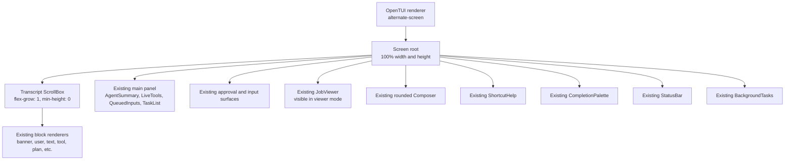

# Fullscreen TUI Migration Plan

## Status

Approved direction: convert the existing TUI to application-owned fullscreen rendering without redesigning it.

This is an architectural migration, not a visual exploration. The current banner, transcript blocks, active-work stack, rounded composer, completion palette, status row, background-task row, popovers, and job viewer remain the product design for this pass. Fullscreen-specific layout opportunities will be considered only after this migration is complete and stable.

## Objective

Replace OpenTUI's split-footer mode and terminal-owned scrollback with:

- OpenTUI alternate-screen ownership of the complete terminal.
- An application-owned, vertically scrollable transcript viewport.
- The current footer hierarchy rendered below that viewport without visual rearrangement.
- Explicit transcript scrolling and reliable tail-follow behavior.
- Clean resize, palette refresh, suspend/resume, and shutdown behavior.

The resulting UI should look like the current Xal TUI placed in a fullscreen terminal surface. The user should not see a new top bar, rail, shelf, pane system, card treatment, or composer treatment.

## Non-goals

The following are explicitly out of scope:

- No top bar or persistent session header outside the existing transcript banner.
- No side gutters, agent rail, work shelf, turn ledger, dashboard, or split-pane transcript.
- No changes to the current component order around the composer.
- No typography, spacing, color, border, icon, or copy redesign.
- No transcript search, bookmarks, turn navigation, minimap, or history browser changes.
- No transcript virtualization, block-anchor navigation, or persistence work in this migration. If the direct migration cannot meet acceptance without one of them, stop and report that blocker for a separate follow-up plan.
- No fullscreen/native-scrollback setting and no compatibility path for split-footer mode.
- No changes to the website's TUI simulation; it already represents the existing visual language and does not share the CLI rendering architecture.
- No new tests, in accordance with the repository convention. Verification is through existing checks and focused manual terminal scenarios.

## Current architecture

The current implementation has two rendering owners:

1. Transcript blocks are rendered into temporary `ScrollbackSurface` instances and committed as immutable rows to the terminal's native scrollback.
2. OpenTUI owns only a dynamically sized `split-footer` containing active work, composer-adjacent surfaces, composer, status, and background tasks.

That division drives several mechanisms that exist only to keep terminal scrollback and the footer synchronized:

- `cursorRow()` discovers where transcript commits should begin.
- `Scrollback` tracks `origin`, `committed`, and committed row counts.
- Streaming output holds unstable rows until they are safe to commit.
- `renderer.footerHeight` is recalculated whenever footer components change height.
- Transcript replay clears saved terminal rows and recommits every visible block after resize, theme changes, details changes, and reasoning visibility changes.
- Palette placement calculates free rows between committed terminal content and the closed footer.
- Agent activity settlement and job-viewer transitions replay transcript rows to repair native scrollback/footer geometry.

These are root causes of the current layout limitations. They should be deleted, not adapted to fullscreen.

## Target architecture



The screen remains one vertical composition. The transcript consumes all rows not required by the current bottom stack. Dynamic footer growth shrinks the transcript viewport through Yoga layout; it no longer changes a terminal scroll region.

The job viewer remains a fullscreen work surface in practice: while it is visible, the transcript and normal main panel are hidden, and the existing job viewer consumes the rows above composer/status/background-task chrome.

## Fixed design contract

### Visual hierarchy

Normal mode must retain this order:

1. Application-owned transcript viewport.
2. `AgentSummary`.
3. `LiveTools`.
4. `QueuedInputs`.
5. `TaskList`.
6. Permission, elicitation, secret, picker, and config surfaces.
7. `JobViewer` when visible.
8. `Composer`.
9. `ShortcutHelp`.
10. `CompletionPalette`, in the same above/below-composer placement model.
11. `StatusBar`.
12. `BackgroundTasks`.

Existing components retain their current constructors, renderable trees, dimensions, colors, margins, borders, and visibility behavior unless a layout property must change solely to participate in the fullscreen flex root.

### Transcript rendering

The existing exhaustive `Block` union and rendering vocabulary remain authoritative:

- banner
- user bubble
- info
- error
- notice
- compaction
- background result
- plan
- text stream
- reasoning stream
- tool result

`renderBlock`, markdown rendering, tool extension renderers, output bounding, grouping of adjacent tools, terminal glyph fallbacks, timestamps, and user-message background calculation remain visually unchanged.

### Transcript ownership

Transcript blocks remain stored as typed application data. Instead of creating temporary `ScrollbackSurface` objects and committing their rows, the transcript owns live OpenTUI renderables under one `ScrollBoxRenderable`.

Each top-level block renderable is a direct child of the scroll box content so OpenTUI's `viewportCulling` can skip offscreen blocks. The transcript exposes its intrinsic occupied rows from the laid-out bottom edge of its final visible block, independent of the scroll box's minimum viewport height. Completion-palette placement uses that intrinsic content extent rather than measuring blank viewport space after the palette has already changed the viewport.

### Tail following

Tail behavior is a functional requirement:

- A new or cleared session starts at the transcript tail.
- New blocks and streaming deltas remain visible while the user is at the tail.
- Scrolling away from the tail disables automatic following.
- New blocks, streaming updates, composer reflow, live-work growth, and task-list growth must not pull a paused user back to the tail.
- Scrolling back to the bottom automatically re-engages following.
- The explicit “end” action immediately returns to the bottom and re-engages following.
- Rebuilds caused by width, palette, details, or reasoning visibility preserve tail state. If paused, preserve distance from the bottom rather than jumping to the newest output.

Use OpenTUI 0.5.1's existing `ScrollBoxRenderable` as the scrolling primitive:

- `scrollY: true`
- `scrollX: false`
- `stickyScroll: true`
- `stickyStart: "bottom"`
- `viewportCulling: true`
- `flexGrow: 1`
- `flexShrink: 1`
- `minHeight: 0`
- column-oriented content

After construction, explicitly set `view.focusable = false` and set both scrollbar renderables' `visible` properties to `false`. OpenTUI 0.5.1 initializes the scroll box and its scrollbars as focusable after applying constructor options, so constructor options or transparent colors alone do not prevent transcript clicks from stealing composer focus.

Keep an application-owned `following` flag as the authority. OpenTUI's private manual-scroll state is insufficient because viewport growth can clamp `scrollTop` to a smaller maximum and silently re-engage bottom stickiness. The transcript must:

- update `following` only after an explicit user scroll operation or a deliberate clear/session/end action, never because layout metrics changed
- defer mouse-wheel state calculation until the next completed frame because OpenTUI invokes registered mouse-scroll callbacks before applying its built-in wheel movement
- capture the current top row before content or footer geometry changes when paused
- after layout, force the tail when following or restore the captured top row when paused, even if OpenTUI clamped and re-engaged its internal sticky state
- preserve distance from the bottom specifically for width-dependent rebuilds, where wrapping changes intrinsic row positions
- guard every deferred restoration with a generation so an older layout cannot overwrite a newer one

This application-owned restoration surrounds transcript appends, stream height changes, screen chrome changes, terminal height changes, rebuilds, and job-viewer hide/show. `ScrollBoxRenderable` still supplies wheel movement, clamping, culling, and scroll coordinates; it does not decide Xal's follow mode.

### Scroll controls

Application ownership requires controls that native terminal scrollback previously supplied. Add configurable shortcut actions without introducing new layout:

| Action                 | Default     | Behavior                                                                                 |
| ---------------------- | ----------- | ---------------------------------------------------------------------------------------- |
| `transcript.page-up`   | `pageup`    | Move upward by one viewport minus one row.                                               |
| `transcript.page-down` | `pagedown`  | Move downward by one viewport minus one row. Re-engage following if the tail is reached. |
| `transcript.start`     | `ctrl+home` | Move to the first transcript row.                                                        |
| `transcript.end`       | `ctrl+end`  | Move to the tail and re-engage following.                                                |

Enable OpenTUI mouse input so wheel scrolling over the transcript uses the scroll box's built-in mouse handling. Keep the transcript and both scrollbar renderables non-focusable and hide the scrollbar renderables so clicking or scrolling cannot steal composer focus or add chrome. Schedule mouse follow-state synchronization for the next completed frame, after OpenTUI has applied the wheel delta.

Transcript shortcuts are inactive while a modal surface is visible, the background-task navigator owns focus, or the job viewer is open. This preserves the existing component-owned navigation precedence.

Do not add transcript guidance to `StatusBar` or `ShortcutHelp` in this pass. A persistent paused hint would mask the status bar's existing notices and activity, and four additional help entries would change the help surface's height. The typed controls and configuration documentation provide the required scrolling and explicit return-to-live action without changing the current UI.

### Streaming

Keep the current redaction and throttling boundary:

- A stream always owns a `StreamBlock`, `RedactedStream`, and last-flush timestamp. Its view and text renderable are optional while an active reasoning stream is hidden.
- Deltas pass through `RedactedStream.write` before entering stored block text or visible content.
- Flush at the existing 50 ms cadence.
- A visible stream flush updates its text renderable's `content` and `height` in place; a hidden reasoning stream updates only redacted stored text.
- Hiding an active reasoning stream destroys its live node without ending or replacing its redactor. Revealing it rebuilds and rebinds one live node from the stored redacted block.
- `endStream` appends `RedactedStream.end`, performs the final update, and retains a visible completed renderable as an ordinary transcript child.
- An empty completed stream is removed from block storage and from the render tree when it has a node.

Delete native-commit concepts from streaming: no temporary surface, committed-row counter, stable-row holdback, `liveRows`, or `commitRows`. These solve terminal scrollback immutability and have no consumer in the live tree.

### Rebuild and reflow

Some transcript content is pre-rendered for a specific width or palette, so rebuilding remains necessary, but “replay” is no longer the right model.

Provide one transcript rebuild operation that:

1. Captures the application-owned follow state and, if paused, its distance from the bottom.
2. Removes and recursively destroys all currently rendered block children.
3. Iterates stored blocks in order.
4. Skips hidden reasoning blocks.
5. Recreates each visible block with the current renderer context, current expansion setting, current user background, and correct previous-visible-block grouping context.
6. Rebinds the active stream's optional view and text renderable without replacing its redactor; leave both absent when the active block is hidden reasoning.
7. Restores the tail or paused distance after the next completed layout frame and reasserts the application-owned follow state.
8. Ignores stale restoration callbacks if another content or geometry preservation request supersedes them or the view is destroyed.

Use this operation for:

- terminal-width changes after the current debounce
- terminal palette changes
- terminal background changes that alter user-message background
- output detail toggles
- reasoning visibility changes

Height-only resize does not require rebuilding markdown. It still runs through the transcript's geometry-preservation path so application-owned follow state wins if OpenTUI clamps the viewport during Yoga layout.

## Detailed code changes

### 1. Replace the scrollback module with a transcript module

Move the rendering domain from:

- `apps/cli/src/plugins/tui/scrollback/blocks.ts`
- `apps/cli/src/plugins/tui/scrollback/render.ts`
- `apps/cli/src/plugins/tui/scrollback/scrollback.ts`

To:

- `apps/cli/src/plugins/tui/transcript/blocks.ts`
- `apps/cli/src/plugins/tui/transcript/render.ts`
- `apps/cli/src/plugins/tui/transcript/transcript.ts`

Do not leave re-export aliases or a compatibility `Scrollback` class.

Keep the block union and rendering functions semantically intact. Rename only scrollback-specific public concepts where the old name is now false.

Implement `Transcript` with this public responsibility set:

- `view`: the `ScrollBoxRenderable` added to the screen root.
- `append(block)`.
- `appendHeader(block)`.
- `appendStream(kind, delta)`.
- `endStream()`.
- `clear()`.
- `clearTranscript()`.
- `toggleExpanded()` / `setExpanded()`.
- `setReasoningVisible()`.
- `setTerminalBackground()`.
- `rebuild()` for width/theme-dependent rerendering.
- typed scroll operations for page up, page down, start, and end.
- application-owned follow state and guarded post-layout restoration.
- intrinsic rendered-content row measurement for palette placement.

Internal state should contain only state with a current consumer:

- `blocks`.
- `header`.
- active stream metadata.
- current expansion and reasoning visibility settings.
- current user-message background.
- rendered block nodes.
- application-owned following state.
- captured top-row or bottom-distance restoration state.
- one generation shared by rebuild and geometry-restoration callbacks.

Delete:

- `ScrollbackSurface` imports and instances.
- `origin`.
- `committed` row counts.
- `rows` as terminal position.
- the commit callback.
- `resetSplitFooterForReplay` calls.
- `createScrollbackSurface` calls.
- `liveRows`.
- stable-row holdback and `commitRows`.

Continue to redact every block before it enters `blocks`, `header`, or a visible renderable. Preserve the exhaustive switch in `redactBlock`.

### 2. Make `Screen` a real fullscreen vertical layout

Update `apps/cli/src/plugins/tui/screen.ts`:

- Rename the public `scrollback` property to `transcript` and update all callers.
- Remove the `startRow` constructor argument.
- Construct `Transcript` with the renderer, preferences, and details shortcut.
- Make `Screen.view` a full-width, full-height, overflow-hidden column.
- Add `transcript.view` as the first child.
- Keep every existing footer child in its current order after the transcript.
- Set every non-transcript direct child and each dynamic child of `mainPanel` to `flexShrink = 0` after construction. OpenTUI defaults auto-height renderables to shrinking, but the transcript must be the only normal-mode surface that yields rows.
- Ensure the transcript can shrink to zero rows when an overlay or job viewer consumes the terminal.
- Rename `syncFooter` to `syncLayout` because it no longer controls renderer footer ownership.

`syncLayout` begins a transcript geometry-preservation cycle before the next root layout and continues to own:

- modal coverage.
- composer visibility and focus.
- task/composer focus transfer.
- palette dismissal while covered.
- the existing completion-palette hint behavior.
- elicitation fitting.
- job-viewer sizing.

Remove all assignments to `renderer.footerHeight`.

Remove the following native-scrollback coordination state and methods:

- `reserved`.
- `reclaim`.
- committed-row callback wiring.
- `agentActivityDirty`.
- `replayAgentActivity`.
- replay calls from agent settlement and job-viewer closure.

`AgentSummary` already notifies `Screen` when its height changes. In fullscreen, `syncLayout` and Yoga immediately return released rows to the transcript, so transcript replay is not needed.

Keep `settleAgentActivity` only if it still performs a real operation after the migration; otherwise delete it and remove its event-controller call.

### 3. Preserve completion-palette placement without terminal row math

The current palette chooses whether to render above or below the composer based on unused rows between transcript content and the closed footer.

Replace `scrollback.rows` and terminal-origin calculations with application-owned metrics while preserving the current closed-palette model:

- `Transcript.contentRows` reports the intrinsic occupied extent of visible block children from the last completed layout, excluding the scroll box's viewport-sized minimum content area. Content mutations invalidate the metric and schedule palette placement to be checked again after the next frame rather than reading incomplete child geometry.
- Retain a `closedChromeRows` calculation for the existing non-palette bottom stack.
- Compute free rows as terminal height minus closed chrome, intrinsic transcript rows, and the existing transcript gap. This value is independent of whether the palette is currently visible and therefore cannot feed back on its own placement.
- `placePalette` compares that closed-palette free space with `PALETTE_CHROME_ROWS`.
- Keep the same render-tree reordering: before the status bar when below the composer, or before the composer when above it.
- Preserve both `paletteLimit` branches: use closed-palette free rows when the palette is below the composer, use terminal height minus closed chrome when it is above, then apply the current palette chrome deduction.
- Do not reserve terminal rows or reclaim committed rows; the flex layout and clipped root are now the boundary.

Verify both placement branches. A short transcript should retain the current below-composer behavior, and a full transcript should retain the current above-composer behavior.

### 4. Preserve the job viewer's effective fullscreen behavior

When `JobViewer` is visible:

- Hide `transcript.view` and `mainPanel`.
- Keep the current overlay/composer, status, and background-task behavior.
- Calculate job-viewer height as terminal height minus visible chrome, as today.
- Do not set `renderer.footerHeight`.
- Keep `JobViewer`'s internal paused-from-bottom scrolling and guidance input unchanged.

When it closes:

- Show `transcript.view` and `mainPanel`.
- Preserve the transcript's previous scroll position and follow state.
- Let Yoga restore the normal transcript/footer split without rebuilding transcript blocks.
- Restore composer focus through the existing task release path.

### 5. Switch renderer ownership to alternate screen

Update `apps/cli/src/plugins/tui/app.ts`:

- Remove `COMPOSER_ROWS` and `STATUS_ROWS` imports used only for initial footer height.
- Remove `cursorRow()` and the `startRow` argument passed into `Screen`.
- Create the renderer with `screenMode: "alternate-screen"`.
- Remove `footerHeight` configuration.
- Enable mouse support for transcript wheel scrolling.
- Keep `clearOnShutdown`, Kitty keyboard configuration, terminal palette detection, terminal title, attention handling, and background color behavior.
- Keep terminal reset as a defensive exit path, but remove split-footer-only reset state if it has no remaining purpose.

OpenTUI owns alternate-screen entry and exit. On normal destroy or signal cleanup, the shell's main screen must be restored rather than cleared or overwritten.

The renderer defaults alternate-screen external output to passthrough. Keep user-facing TUI output routed through transcript blocks and continue routing attention OSC sequences through `TerminalOutput`. Do not introduce normal `stdout` writes while the renderer is active.

### 6. Simplify resize, theme, and session lifecycle

In `app.ts`:

- Rename `replayLayout` to `reflowLayout`.
- On a width change, reflow the composer, synchronize screen layout, and rebuild transcript renderables after the existing debounce.
- On a height-only change, synchronize layout without rebuilding width-dependent transcript content.
- Preserve the current “defer resize work while external editor is active” behavior.
- After external-editor resume, resize the renderer, resume alternate screen, reflow if required, and restore the composer draft exactly as today.
- On terminal palette or terminal-background change, update colors and rebuild the transcript rather than replaying terminal rows.
- On session start, clear transcript state and append the existing banner header.

Explicitly verify suspend/resume because alternate-screen transitions are materially different from split-footer transitions even though OpenTUI exposes the same methods.

### 7. Update all transcript consumers

Update direct callers in:

- `apps/cli/src/plugins/tui/controllers/agent-events.ts`
- `apps/cli/src/plugins/tui/controllers/app-events.ts`
- `apps/cli/src/plugins/tui/controllers/keymap.ts`
- `apps/cli/src/plugins/tui/app.ts`
- `apps/cli/src/plugins/tui/screen.ts`

Use `screen.transcript` consistently. Do not retain a `scrollback` property alias.

Agent and app event mapping remains unchanged: the same event types append the same block types with the same content.

### 8. Add transcript actions to the typed shortcut seam

Update `apps/cli/src/plugins/tui/shortcuts.ts`:

- Add the four transcript actions to `ShortcutAction`.
- Add defaults and descriptions.
- Add all four cases to `isShortcutAction`.
- Preserve conflict validation and override parsing.

Update `apps/cli/src/plugins/tui/controllers/keymap.ts`:

- Make transcript actions active only when no modal, focused task navigator, or job viewer owns the relevant keys.
- Add exhaustive action handling that delegates to typed transcript scroll methods.
- Preserve all existing shortcut, component, palette, history, task, and interrupt precedence.

Do not change `ShortcutHelp`; adding entries would change its current height. No raw key handling should bypass the typed shortcut system.

### 9. Delete obsolete cursor probing

Delete `apps/cli/src/plugins/tui/lib/cursor.ts` after removing its only import and caller.

Alternate-screen rendering always begins in an owned coordinate system, so the shell cursor's pre-launch row is irrelevant. Keeping the probe would add startup latency and consume terminal input without a current purpose.

### 10. Update configuration documentation

Update `docs/configs.md`:

- Add the four transcript shortcut actions and defaults to the keybinding table.
- Explain that the transcript is application-owned in fullscreen mode.
- Document tail following, paused scrolling, and the return-to-live action concisely.
- Change `display.clear` documentation: it clears the visible application transcript while preserving startup headers, session, and composer draft. It no longer clears pre-launch terminal scrollback because the shell's main screen is outside the alternate-screen application.
- Keep configuration examples valid and formatted.

Do not add a fullscreen option or native-scrollback compatibility documentation.

## Data and lifecycle invariants

Implementation must preserve these guarantees:

1. Raw secrets never enter stored transcript block text or visible renderables.
2. Streaming redaction state survives transcript rebuilds.
3. Every renderable removed during clear or rebuild is recursively destroyed exactly once.
4. The active stream has at most one live transcript renderable and has none while it is hidden reasoning.
5. `blocks` order and render-tree order are identical for visible blocks.
6. Header blocks remain the same stored block instances used by `clearTranscript`.
7. Reasoning visibility affects rendering, not stored conversation data.
8. Detail expansion affects rendering, not stored block data.
9. Application-owned follow state cannot be changed by OpenTUI clamping during content, footer, or terminal geometry changes.
10. A paused viewport never jumps to the tail because content or footer height changed, and a following viewport never gets stranded above new content.
11. Closing and reopening the job viewer does not lose transcript blocks or scroll state.
12. Resize restoration callbacks cannot apply stale positions after a later rebuild or destroy.
13. Renderer shutdown restores terminal keyboard, mouse, cursor, title/background, and alternate-screen state.

## Implementation sequence

### Phase 1: Introduce the live transcript tree

1. Move the scrollback directory to `transcript`.
2. Preserve `blocks.ts` and `render.ts` behavior under the new path.
3. Replace `Scrollback` with `Transcript` and live renderables.
4. Implement append, streaming, clear, visibility, expansion, rebuild, application-owned follow restoration, and intrinsic-content measurement APIs.
5. Update imports and consumer property names so the repository typechecks without compatibility aliases.

Expected checkpoint: transcript data and rendering no longer depend on `ScrollbackSurface`, but the screen is not yet considered complete until the fullscreen root is wired.

### Phase 2: Convert the screen root

1. Add the transcript viewport as the first root child.
2. Keep current footer children in order and make all non-transcript surfaces non-shrinking.
3. Remove footer-height writes and row-reclaim state.
4. Adapt palette placement to intrinsic transcript rows and closed-chrome metrics.
5. Adapt job-viewer visibility and sizing through guarded transcript geometry preservation.
6. Remove agent-activity replay machinery.

Expected checkpoint: one OpenTUI render tree represents the complete UI and Yoga owns all vertical allocation.

### Phase 3: Switch terminal mode and lifecycle

1. Select alternate-screen mode.
2. Remove cursor probing and initial footer constants.
3. Enable mouse wheel support.
4. Split width reflow from height-only resize.
5. Replace palette/background replay calls with transcript rebuilds.
6. Verify external-editor suspend/resume and terminal cleanup.

Expected checkpoint: Xal enters, owns, resizes, suspends, resumes, and exits fullscreen cleanly.

### Phase 4: Add application-owned scroll controls

1. Add typed transcript shortcut actions.
2. Route them with existing focus precedence.
3. Add post-frame mouse follow-state synchronization.
4. Leave status and shortcut-help rendering unchanged.

Expected checkpoint: keyboard and mouse scrolling replace native terminal scrollback behavior without changing the layout or copy.

### Phase 5: Documentation and final cleanup

1. Update `docs/configs.md`.
2. Search for stale `scrollback`, `split-footer`, `footerHeight`, `ScrollbackSurface`, `resetSplitFooterForReplay`, and `cursorRow` references in Xal's TUI.
3. Delete unused imports, state, methods, and files.
4. Run formatting and repository checks.
5. Perform the manual verification matrix below.

## Verification plan

### Automated repository checks

Run the repository-required command after implementation:

```sh
bun checks:fix
```

This must finish with typecheck, lint, formatting, and the repository's existing test command passing. Do not add tests for this change.

Also run focused searches proving the old architecture is gone from Xal's TUI:

```sh
rg 'split-footer|footerHeight|createScrollbackSurface|resetSplitFooterForReplay|commitRows|cursorRow' apps/cli/src/plugins/tui
```

Expected result: no Xal TUI references. References inside the OpenTUI dependency are irrelevant.

### Manual terminal matrix

Perform the critical scenarios in at least one normal terminal and, where available, tmux.

#### Startup and visual parity

- Launch Xal from a shell containing prior output.
- Confirm Xal enters alternate screen and occupies the terminal.
- Confirm the existing banner appears in the transcript.
- Confirm the existing rounded composer, status row, and background-task row remain visually unchanged.
- Confirm no top bar or new permanent chrome exists.
- Quit and confirm the prior shell screen is restored.

#### Transcript rendering

Generate or replay a session containing every block kind:

- banner
- user message with timestamp
- assistant markdown
- reasoning summary
- info and error
- notice
- plan
- successful and failed tool output
- background result
- compaction

Compare wrapping, spacing, colors, grouping, detail panels, and output bounds with the current TUI behavior.

#### Streaming and redaction

- Stream enough assistant output to exceed one viewport.
- Confirm updates are smooth and remain at the tail while following.
- Confirm the final stream does not duplicate, drop, or reorder text.
- Exercise a redacted value split across streaming deltas and confirm it never appears.
- Toggle reasoning visibility during or after a reasoning stream and confirm stored content remains valid.

#### Scrolling and follow mode

- Use Page Up to leave the tail.
- Confirm the status row and shortcut-help surface remain unchanged.
- Continue streaming and confirm the viewport does not move to new content.
- Grow and shrink live tools, tasks, and composer height while paused; confirm the viewed area remains stable.
- Use Page Down until the tail and confirm following resumes.
- Pause again and use Ctrl+End; confirm immediate return to live.
- Use Ctrl+Home and confirm the first transcript content is reachable.
- Scroll with the mouse wheel and confirm the same pause/resume semantics.
- Confirm transcript scrolling never steals composer focus or inserts input.

#### Details, clear, and palette refresh

- Toggle output details and confirm all affected blocks rebuild without changing scroll mode.
- Toggle reasoning visibility and confirm hidden/revealed content is correct.
- Press Ctrl+L and confirm only startup header blocks remain while session and composer draft survive.
- Trigger terminal palette/background refresh if supported and confirm user bubbles and text repaint without duplicate blocks.

#### Completion palette

- Open completion with a short transcript and verify the current below-composer placement.
- Fill the transcript, open completion again, and verify the current above-composer placement.
- Confirm selection, completion, dismissal, status hints, and composer focus are unchanged.
- Resize while the palette is visible and verify it remains clipped and positioned correctly.

#### Popovers and active work

Exercise:

- permission approval
- elicitation
- secret input
- picker
- config
- shortcut help
- queued inputs
- task list
- live tools
- agent summary
- background-task navigator

Confirm each uses the same rows, visibility rules, focus rules, and component order as before while the transcript simply yields available height.

#### Job viewer

- Open a running agent or process.
- Confirm the viewer consumes the area above composer/status/background tasks.
- Page through output using its existing controls.
- Enter and cancel/send agent guidance.
- Close the viewer and confirm the prior transcript scroll position and follow state return unchanged.

#### Resize and small terminals

- Resize width repeatedly during idle and streaming states.
- Confirm markdown, user bubbles, tools, status, and composer reflow correctly.
- Resize height while following and while paused.
- Confirm height-only changes do not rebuild or duplicate transcript content.
- Shrink until the bottom stack consumes nearly all rows and confirm the root clips cleanly without terminal corruption.
- Expand again and confirm transcript state is intact.

#### External editor and shutdown

- Open the external editor with an empty and non-empty draft.
- Confirm Xal leaves alternate screen before the editor runs.
- Resize while the editor is active.
- Exit with and without changing text.
- Confirm Xal re-enters alternate screen, restores the draft correctly, and reflows once.
- Verify Ctrl+C interrupt and double-Ctrl+C quit behavior.
- Verify normal quit and termination signals restore cursor, mouse, keyboard protocol, colors, and shell screen.

## Risks and mitigations

### Long-session render-tree cost

Risk: terminal scrollback previously held immutable history outside OpenTUI; fullscreen keeps one renderable subtree per visible block.

Mitigation: keep each block as a direct scroll-box child and enable `viewportCulling`. Do not add virtualization in this migration. If a realistically long acceptance session shows unacceptable layout or memory cost, stop and report it as a blocker for a separate virtualization plan.

### Paused-position drift during width reflow

Risk: line wrapping changes block heights, so preserving an absolute `scrollTop` can jump to a different logical area.

Mitigation: preserve distance from the bottom and restore only after layout settles. Tail state is exact; paused state must remain near the same history region. Do not add block-anchor navigation in this migration; if distance preservation fails acceptance, stop and report it as a blocker for a separate plan.

### Footer growth affecting follow mode

Risk: dynamic active-work or composer height changes alter transcript viewport height.

Mitigation: make the bottom stack non-shrinking and the transcript the exclusive flex shrink target. Wrap every screen-geometry change in application-owned capture and guarded post-frame restoration so OpenTUI clamping cannot change follow state. Do not calculate or write terminal scroll regions.

### Mouse reporting and selection

Risk: enabling mouse input changes terminal text-selection conventions.

Mitigation: explicitly disable focus after constructing the transcript and both scrollbar renderables, hide both scrollbars, use OpenTUI's selection support, and verify wheel scrolling and text selection in supported terminals. Do not add custom mouse gestures.

### Alternate-screen suspend/resume

Risk: the external editor and process termination now cross alternate-screen boundaries instead of a split footer.

Mitigation: retain the renderer's `suspend`/`resume` lifecycle, resize before resume as today, and explicitly verify normal, error, signal, and editor paths.

### Stale renderables or frame callbacks

Risk: rebuilds during resize, palette changes, or streaming can leave detached nodes or apply outdated scroll restoration.

Mitigation: recursively destroy every removed block node, use a monotonically increasing rebuild generation, and guard deferred frame restoration against supersession and destroyed views.

### External writes corrupting fullscreen

Risk: ordinary stdout/stderr output can paint over the alternate screen.

Mitigation: keep all user-facing TUI output in transcript/status components, keep attention writes limited to terminal control sequences, and rely on the renderer's console handling for exceptional diagnostics. Failures must remain visible and must not be swallowed.

## Definition of done

The migration is complete only when all of the following are true:

- Xal uses OpenTUI alternate-screen mode and owns the complete viewport.
- No Xal TUI code creates or commits `ScrollbackSurface` rows.
- No Xal TUI code reads or writes `renderer.footerHeight`.
- Cursor-row probing is deleted.
- The transcript is a live, scrollable, culled OpenTUI tree.
- Existing transcript block appearance and footer component order are unchanged.
- Streaming, redaction, details, reasoning visibility, clear, palette refresh, and session reset work through the live tree.
- Keyboard and mouse transcript scrolling work.
- Application-owned tail follow pauses away from the bottom, survives content and geometry changes, and resumes only through explicit user scrolling to the bottom or the end action.
- Status and shortcut-help content and dimensions remain unchanged.
- Completion palette placement retains both current branches without depending on its own visible height.
- Popovers, active work, and the job viewer preserve current focus and visibility behavior.
- Width and height resizing preserve content and scroll mode.
- External editor suspend/resume is clean.
- Quit and failure paths restore the shell terminal.
- `docs/configs.md` describes the new shortcut actions and correct clear behavior.
- `bun checks:fix` passes.
- No redesign or follow-on fullscreen opportunity is included in the implementation diff.
